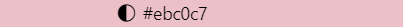

# README

Hello, I am Emilia Caccavo, a student learning web development.  I am passionate about learning and building user-friendly websites.  This repository contain an About Me, where I display my new skills and my interests.  By working on this project, I have gained valuable knowledge and experience in web development, including using HTML, CSS, and making web pages more accessible and easy to use.

For my color scheme, I wanted to use colors I often use to make my plushies.  Pink, white, black, dark blue, and light blue are perfect because they compliment eachother while having a high contrast.

The pink I used: #ebc0c7 ()
The dark blue I used: #2C7C9B ()
The light blue I used: #add8e6 ()
Black: 000000 ()
White: #FFFFFF ()

